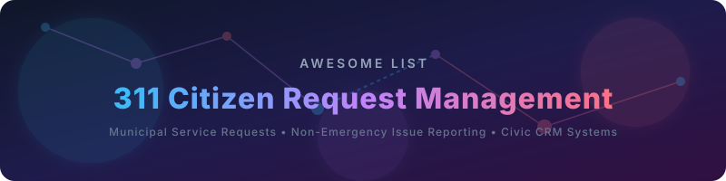

# Awesome 311 Citizen Request Management 🏙️

> A curated list of awesome 311 Citizen Request Management platforms, municipal service request systems, non-emergency issue reporting tools, and open-source civic CRM solutions.

### 🔍 GovTech SEO Keywords
`Civic Tech` • `Municipal CRM` • `Open311 GeoReport API` • `Non-Emergency Issue Reporting` • `Local Government Software` • `Smart City Apps` • `Open-Source 311` • `Pothole & Streetlight Reporting` • `GovTech Solutions`

---

## 🏛️ Similar Projects to 311 Citizen Request Management Platforms

**311 Citizen Request Management** 🏙️ (also called municipal service request, non-emergency issue reporting, or civic CRM systems) enables residents to report problems such as potholes 🕳️, broken streetlights 💡, graffiti 🎨, and other public-space issues, while giving city staff tools for intake, routing, tracking, field work, and public status updates. Leading commercial tools include SeeClickFix, Cityworks, OpenGov Citizen Services, QScend, Accela CRM, Neighborly Software, Rock Solid Technologies, CitySourced, MyCivic, and Request Tracker Pro.

Below is a **curated list** 📚 of notable platforms and their open-source equivalents. The emphasis is on **open-source** 🔓 solutions that support map-based reporting, Open311 compatibility, workflow management, and self-hosting so municipalities can retain full control of citizen data.

## 🏢 SaaS / Hosted Platforms

| Platform | Description | Pricing | Free Tier / Limit | Company Size (Est. Revenue / Valuation) |
|---|---|---|---|---|
| **[Cityworks](https://www.cityworks.com/)** (Trimble) | GIS-centric asset and work management system built on Esri ArcGIS, widely used for infrastructure work orders and 311 service requests. | Custom quote based on deployment scope and modules. | No free tier. | Parent: Trimble (Est. $3.59B Revenue) |
| **[MyCivic](https://mycivicapps.com/)** | Citizen engagement and service request applications for local government. | Custom quote / contract-based. | No free tier. | Parent: Tyler Technologies (Est. $2.33B Revenue) |
| **[OpenGov Citizen Services](https://opengov.com/)** | Government operations platform that includes citizen request intake, routing, and performance reporting. | Custom quote / subscription based on agency size and modules. | No free tier. | Est. $1.8B Valuation |
| **[Accela CRM / Civic Platform](https://www.accela.com/)** | Broad civic services suite covering permitting, licensing, inspections, and service request management. | Custom quote based on agency size and transaction volumes. | No free tier. | Est. $108M - $144M Revenue |
| **[SeeClickFix](https://www.seeclickfix.com/)** (CivicPlus) | Popular resident-facing 311 CRM focused on simple mobile reporting, photo uploads, map views, and transparent issue tracking for local governments. | Custom quote / subscription (311 CRM Starter Package available for small teams). | No free tier for municipalities (residents can use the reporting tools for free). | Est. $78.9M Revenue / $290M Funding |
| **[Rock Solid Technologies](https://www.rocksolid.com/)** | Public-sector technology solutions including citizen service and request management tools. | Custom quote / contract-based. | No free tier. | Est. $8.1M - $25.9M Revenue |
| **[Neighborly Software](https://neighborlysoftware.com/)** | Community and municipal software that includes request and engagement features. | Custom quote / subscription (contract sizes typically range from $12,000 to $60,000+/year). | No free tier. | Est. $21.6M Revenue |
| **[CitySourced](https://www.citysourced.com/)** (now part of Granicus OneView) | Mobile-first civic reporting and engagement platform. | Custom quote / contract-based. | No free tier. | Est. $4.7M Revenue |
| **[QScend / QAlert](https://www.qscend.com/)** | Citizen request and incident management software used by municipalities for service tracking and notifications. | Custom quote / contract-based. | No free tier. | Est. $4.5M Revenue |
| **[Request Tracker Pro](https://www.bestpractical.com/)** | Enterprise request-tracking solutions sometimes adapted for municipal use. | Cloud hosting plans start at ~$15 to $39+ per user/month. | Free self-hosted open-source version (no user limits, but requires own infrastructure and maintenance). | Est. $2.5M Revenue |

## 🔓 Open-Source Software

### 🗺️ Dedicated 311 / Civic Request Platforms
- **[FixMyStreet](https://github.com/mysociety/fixmystreet)**  (mySociety) — 🔧 The classic open-source platform for reporting local problems to authorities. Supports map-based reporting, photo uploads, email/SMS notifications, and Open311. Widely deployed and actively maintained (AGPL).
- **[uReport](https://github.com/City-of-Bloomington/uReport)**  — 📢 Issue tracking and constituent relationship management system with an Open311 endpoint, developed by the City of Bloomington for smaller municipalities (AGPL).
- **[GovFlow](https://github.com/govflow/govflow)**  — 🌊 Open-source, modular request and work-order management system designed for local government. Supports 311 requests, multi-channel intake, analytics dashboards, and Open311 compatibility (MIT).
- **[OpenCiRM](https://github.com/sharegov/opencirm)**  — 🏛️ Open-source Citizen Relationship Management platform originally supporting Miami-Dade County 311. Metadata-driven and designed for government service call centers.
- **[Mark-a-Spot](https://github.com/markaspot/mark-a-spot)**  — 📍 Modern open-source Open311/GeoReport v2 platform built on Drupal + Nuxt. Features map reporting, AI-assisted categorization and duplicate detection, staff workflows, crisis mode, and full self-hosting (GPL components). Strong European municipal adoption.
- **[Libre311](https://github.com/UnityFoundation-io/Libre311)**  — 🌐 Open-source web application for municipal service requests built directly on the Open311 GeoReport v2 standard. Includes public map/list views, admin dashboard, and REST API.
- **[Pinpoint 311](https://pinpoint311.org/)** — 📌 Free, open-source (MIT) municipal reporting software focused on low-cost self-hosting, automatic routing, multi-language support, and Open311 compliance. Aimed at small-to-medium towns.

### 🌐 Broader Civic & Municipal Platforms
- **[Lutece](https://github.com/lutece-platform/lutece-core)**  (City of Paris) — 🗼 Long-standing open-source municipal service platform with CRM and “Dans ma Rue” (In My Street) modules for public-space incident reporting and field workflow.
- **Open311** itself — 🔌 The open standard (GeoReport v2) that many of the above systems implement. Enables interoperable citizen reporting apps and backend systems.

### 🎫 General Open-Source Helpdesk / Ticketing (Adaptable for 311)
- **[GLPI](https://github.com/glpi-project/glpi)**  — 🛠️ Open-source ITSM and asset management platform that can be extended for municipal work orders.
- **[FreeScout](https://github.com/freescout-helpdesk/freescout)**  — ✉️ Lightweight open-source shared inbox and helpdesk.
- **[osTicket](https://github.com/osTicket/osTicket)**  — 🎫 Classic open-source support ticket system that some municipalities adapt for service requests.
- **[Zammad](https://github.com/zammad/zammad)**  — 💬 Modern open-source helpdesk with multi-channel support, useful as a foundation for internal request handling.

### 🛠️ Typical Open-Source Stack
Many cities combine:
1. A citizen-facing reporting front-end (FixMyStreet, Mark-a-Spot, Libre311, or Pinpoint 311)
2. Open311-compliant API for mobile apps and third-party integrations
3. Internal workflow / ticketing (GovFlow, Zammad, or existing municipal systems)
4. Optional GIS integration (Leaflet, OpenStreetMap, or Esri)

This approach gives full data ownership, avoids vendor lock-in, and supports transparency requirements common in the public sector.

---

**🤝 How to contribute**  
Fork this repository, add a new project (with link + short description + category), and open a pull request.  
Prefer actively maintained open-source projects that support map-based citizen reporting, Open311, or municipal request workflows.

**📄 License**  
This list is public domain / CC0. Feel free to copy into your own awesome list or README.

Star the projects you find useful — open-source civic tech helps cities serve residents better! 🏙️

##  Star History

<a href="https://www.star-history.com/?repos=ishandutta2007%2FAwesome-311-Citizen-Request-Management&type=date&legend=bottom-right">
<picture>
<source media="(prefers-color-scheme: dark)" srcset="https://api.star-history.com/chart?repos=ishandutta2007/Awesome-311-Citizen-Request-Management&type=date&theme=dark&legend=bottom-right" />
<source media="(prefers-color-scheme: light)" srcset="https://api.star-history.com/chart?repos=ishandutta2007/Awesome-311-Citizen-Request-Management&type=date&legend=bottom-right" />

</picture>
</a>

